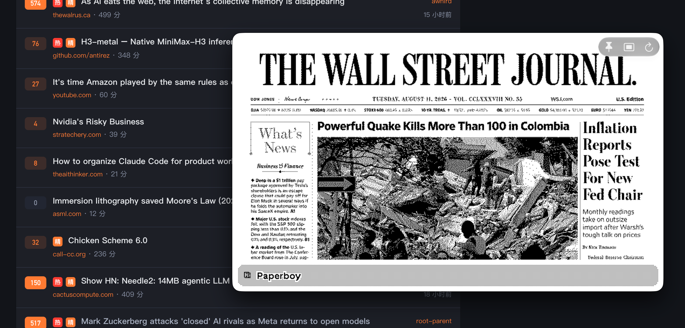

# HereTRMNL

A macOS menu bar app that mirrors your [LaraPaper](https://github.com/usetrmnl) / TRMNL BYOS screen on the desktop. The display sits between the wallpaper and the desktop icons (click-through while an image is shown).

<p align="center">
  
</p>

## Features

- Lives in the menu bar (no Dock icon)
- Desktop-layer window: above wallpaper, below Finder icons; clicks pass through when a screen is showing
- Fixed device-sized layout; choose display, corner (or center), and original / half size from the menu bar
- Bottom / side placement clears the Dock; top placement stays clear of the menu bar
- Polls `GET /api/display` with firmware-style `ID` and `Access-Token` headers
- Shows `image_url` and refreshes on `refresh_rate`
- Skips redraw when `filename` / `image_name` is unchanged
- Manual refresh, display tone (light / dark / automatic), launch at login

## Requirements

- macOS 26.0+
- Xcode 26+
- A LaraPaper-compatible base URL, device ID (MAC), and access token

## Build

```bash
open HereTRMNL.xcodeproj
```

Select the **HereTRMNL** scheme and Run.

## Setup

1. Open **Connection Settings…** from the menu bar item (or ⌘,)
2. Enter the base URL (e.g. `https://your-server.example`) — without `/api/display`
3. Enter Device ID and Access Token
4. **Connect** (or **Verify and Save** when editing)

Manual refresh: menu bar **Refresh Now** or ⌘R. Placement: menu bar **Screen** / **Position**. Quit from the menu bar item.
